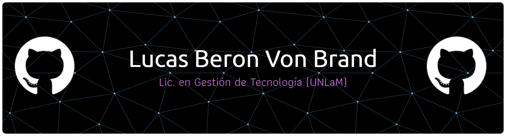

# Perfil Profesional

**Java Backend Developer | QA Automation Tester**

* ✔️ Desarrollando APIs REST con Spring Boot, Spring Security (JWT/OAuth2) y arquitectura de microservicios.
* ✔️ Experiencia en QA Automation con JUnit, Mockito, MockMvc, Selenium y Cucumber (BDD).
* ✔️ Proyecto de tesis: plataforma backend con Machine Learning (Weka) e IA generativa (Google Gemini).
* ✔️ Licenciado en Gestión de Tecnología (UNLaM) y Técnico en Programación (UNLZ).
* ✔️ En búsqueda de mi primera oportunidad para aportar valor y crecer profesionalmente.

## Contacto
 

## Stack Tecnológico
          
